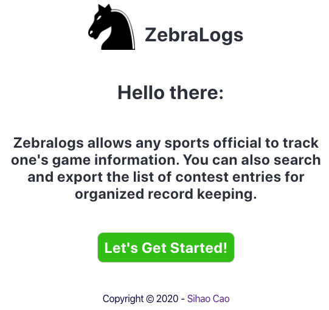
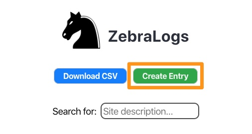
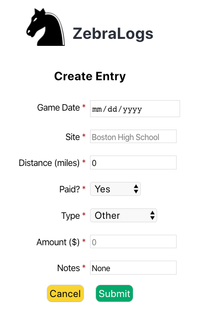
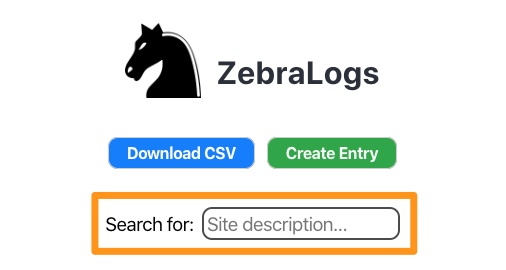
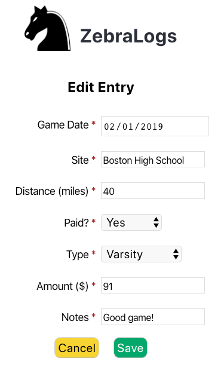
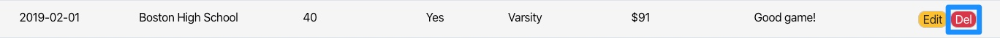
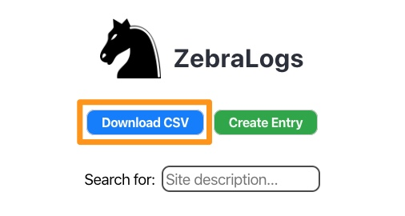

# Zebralogs -- web application
Zebralogs allows any sports official to track one's contest information along with the ability to export the list of entries.
## Demo
[Live Page](https://zebralog-client.now.sh/)
## App Motivation
* Zebralogs is for those hobby sports officials who wish to log the distance they've travelled to game sites as well as keeping track of how much they are getting paid for each game worked. As a sports official myself, I like to log the aforementioned information in an app so I can have all the pertinent data at my disposal when it comes to tax time to accurately report my income (e.g., game fees) and expenses (e.g., miles driven) as a independent contractor.
## App Description
* Zebralogs is a full-stack web app built with React, CSS, Node, Express, and Postgresql. This website does not use any third-party API. This website is supported on Chrome, Firefox, and Safari. This app is a fully responsive website.
## Screenshots
* Landing Page:

* Main Page:

* Create Entry Button:

* Create Entry Page:

* Search for Site Description:

* Edit Entry Button:

* Edit Entry Page:

* Delete Entry Button:

* Download CSV Button:

## How to Use the App
* Users can create a new entry by clicking on the "Add Entry" button and then completing the "Add Entry" form. They can also update an existing entry by clicking on the "Edit" button and completing the "Edit Entry" form. For any entry that they wish to delete, users can click on the "Del" button and a window will pop up confirming if they do indeed want to delete the selected entry. If users wish to proceed with the delete process, they can click on the "OK" button in the pop-up dialog box. if users want to search for a specific site, they can use the search input box located above the list of entries. For record keeping purposes, users can also export the current list of entries as a CSV file by clicking on the "Download CSV" button.
## Built With
* Reactjs
* Vanilla CSS
* Node.js
* Express.js
* Postgresql
## Authors
* Sihao Cao